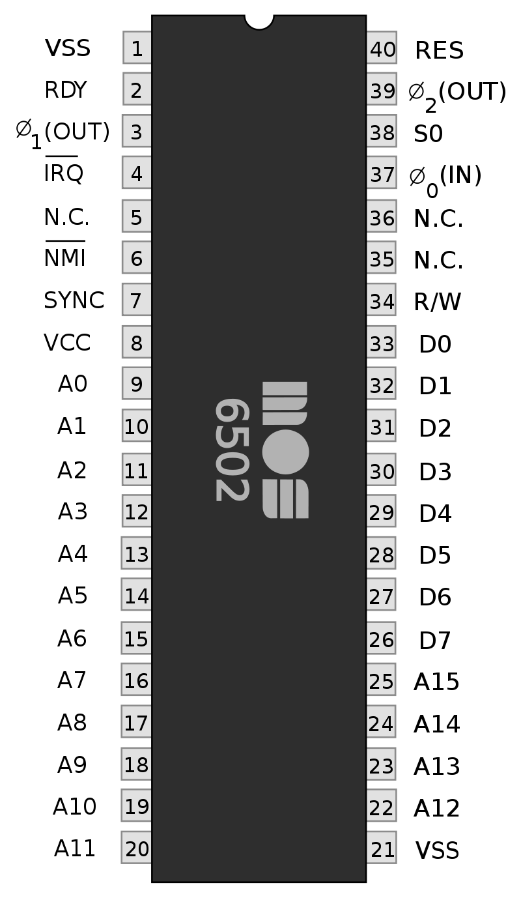
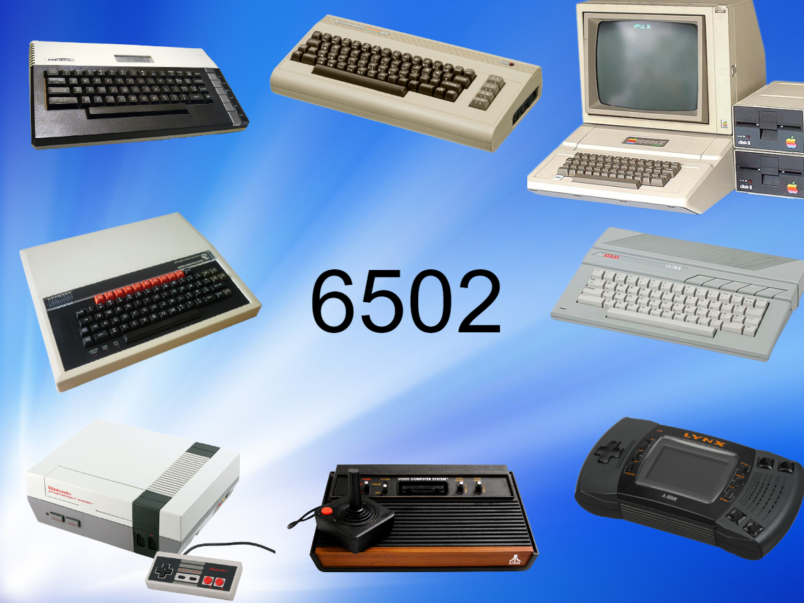

# 6502
# Atari 8-bit
# Sizecoding
---
<!-- paginate: true -->
<!-- header: '_6502 Atari 8-bit Sizecoding_' -->
<!-- footer: '_F#READY_ @ _Lovebyte party 2021_' -->

### F#READY
- Software Engineer
- Retrocomputing
- Demoscene (oldskool)
- Atarian
- Cycloholic
---
### Why sizecoding?
- Creative limitation
- In full control
- Demo appreciation
- Fun 😎
---
### Contents
1. 6502 sizecoding
2. Atari specific

---
### PART 1
### 6502 sizecoding


---


---
### 6502 overview
- 56 instructions
- No multiply, divide
- No trig instructions
- Three 8-bit registers
- 1..2 MHz
---
### Branch vs jump

Absolute jump

```
    jmp label	    ; 3
```

Relative branch 

```
    bne label	    ; 2
```
Watch your N,Z,V flags
Use the non-changing one as jmp

---
### Inline subroutine

```
	...main code...
	jsr subroutine	; 3

subroutine
	...subroutine code...
	rts				; 1
```

Saves 4 bytes

```
	...main code...
	...subroutine code...
```
---
### Loops
Countup

```
	org $8000
	
	ldx #0      ; 2
next
	lda foo,x   ; 3
	...
	inx         ; 1
	cpx #10	    ; 2
	bne next    ; 2
```
10 bytes

---
### Loops
Countdown

```
	org $8000
	
	ldx #9      ; 2
next
	lda foo,x   ; 3
	...
	dex         ; 1
	bpl next    ; 2
```
8 bytes

---	
### Loops
Countdown on zeropage

```
	org $80
	
	ldx #9      ; 2
next
	lda foo,x   ; 2 - zp,x
	...
	dex         ; 1
	bpl next    ; 2
```
7 bytes

---
### Copy 
Copy <= 129 bytes

```
	ldx #128
copy
	lda from,x		; from [128..0]
	sta to,x
	dex
	bpl copy
```
Easy!

---
### Copy
Copy 256 bytes

```
	ldx #0
copy
	lda from,x		; from [0, 255..1]
	sta to,x
	dex
	bne copy
```
Easy!

---
### Copy
Copy 129 to 256 bytes (e.g. 200)

```
	ldx #199
copy
	lda from,x		; from [199..0]
	sta to,x		; to [199..0]
	dex
	cpx #255		; want to include 0
	bne copy
```
Upcount doesn't help

---
### Copy
Getting rid of cpx

```
	ldx #200
copy
	lda from-1,x	; from [199..0]
	sta to-1,x
	dex
	bne copy
```
Saved 2 bytes

---
### Copy
Do not worry about extra bytes copied

```
	ldx #0
copy
	lda from,x		; from [0, 255..1]
	sta to,x
	dex
	bne copy
```
Copy 256 bytes is easy!

---
### Re-use x,y

```
	ldx #0
loop1
	... using x...
	ldy #0
loop2
	... using y...
	dey
	... need another index register :(
	
	bne loop2
	bne loop1
```
Out of registers already?

---
### Re-use x,y
Use the stack?

```
	... need another index register :(
	tya
	pha
	... use y again
	pla
	tay	
```
4 bytes
Destroys A :(

---
### Re-use x,y

Use zeropage

```
	... need another index register :(
	sty temp_y
	... use y again
	ldy temp_y
```
4 bytes + temp_y on zero page

---
### Re-use x,y
Self-modifying code

```
	... need another index register :(
	sty here
	... use y again
here = *+1
	ldy #0
```
4 bytes

---
### Initialise variables
Schoolbook example

```
some_var
	dta 0               ; 1
	
	lda #42             ; 2
	sta some_var        ; 2 (zp)
	...
	
	lda some_var        ; 2 (zp)
	...
```
7 bytes

---
### Initialise variables
Self-modifying code, zero page

```
some_var = *+1
	lda #42             ; 2
	...

	lda some_var        ; 2
	...
```
4 bytes

---
### Add/substract

```
	lda some_var        ; 2
	clc                 ; 1
	adc #3              ; 2
	sta some_var        ; 2
```
Adding 1, 2 or 3? Use inc

```
	inc some_var        ; 2
	inc some_var        ; 2
	inc some_var        ; 2
```

Substract? Same...

---
### Use register state

```
	ldx #0
loop
	...
	dex
	bne loop

	lda #0
	sta some_var
```
Can we use something else?

---
### Use register state

```
	ldx #0
loop
	...
	dex
	bne loop

	stx some_var	; x = 0 after bne
```
Saved 2 bytes

---
### Combine loops

Two loops (19 bytes)

```
	ldx #0
p1	txa
	sta table256,x		; fill page 0..255
	inx
	bne p1

	ldx #0
p2	lda #42
	sta page42,x		; fill with 42
	inx
	bne p2
```

---
### Combine loops

One loop (14 bytes)

```
	ldx #0
p1
	txa
	sta table256,x		; fill page 0..255
	lda #42
	sta page42,x		; fill with 42
	inx
	bne p1
```
Saved 5 bytes

---
### Undocumented opcodes

```
	lda $1234
	tax
```
Load A and X from memory
```
	lax $1234
```

Most are very obscure :)

---
#### Links

F#READY
https://github.com/FreddyOffenga
https://demozoo.org/sceners/35273/

Sizecoding
http://www.sizecoding.org
