# 6502
# Atari 8-bit
# Sizecoding
---
<!-- paginate: true -->
<!-- header: '_6502 Atari 8-bit Sizecoding_' -->
<!-- footer: '_F#READY_ @ _Lovebyte party 2021_' -->
### PART 2
### Atari 8-bit
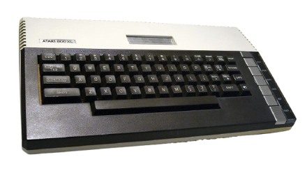
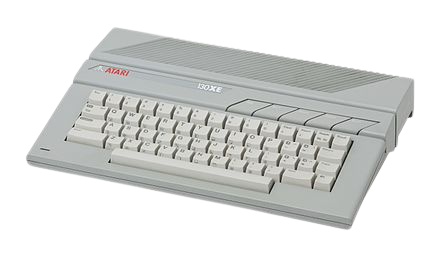
<br/>
<br/>
A humble introduction for sizecoders :)

---
### Atari 8-bit limits
- 1.77 MHz CPU
- 64KB RAM
- Slow plot/drawto
- Low resolution

---
### Atari 8-bit features
- Graphics/Text modes
- Display list
- Hardware scrolling
- Player/Missiles (sprites)
- Sound  (POKEY)
- OS ROM (16 KB)
- BASIC ROM (8 KB)
---
### Memory Map

Overview
```
  OS ROM / RAM  $D800 - $FFFF 10 KB 
  Hardware I/O  $D000 - $D7FF  2 KB Also OS ROM Self-Test
  OS ROM / RAM  $C000 - $CFFF  4 KB
  User RAM      $A000 - $BFFF  8 KB Depends on gfx/text mode
  User RAM      $8000 - $9FFF  8 KB BASIC ROM
  User RAM      $2000 - $7FFF 24 KB
  FMS/DOS       $0700 - $1FFF |
  User RAM      $0480 - $06FF |
  OS            $0200 - $047F | 8KB
  Stack         $0100 - $01FF |
  Zero Page     $0000 - $00FF |
```
---
### Memory Map

Hardware I/O
```
  ANTIC         $D400 - $D4FF Graphics / Display List
  PIA           $D300 - $D3FF Joysticks
  POKEY         $D200 - $D2FF Sound
  PBI I/O       $D100 - $D1FF Extension I/O
  GTIA          $D000 - $D0FF Colors / Sprites
```

---
### Text modes
- 40 x 24 - 2 colors
- 40 x 24 - 4 colors (5th by inverse character)
- 40 x 12 - 4 colors (5th by inverse character)
- 20 x 24 - 4 colors (1 color per character)
- 20 x 12 - 4 colors (1 color per character)

ATASCII set holds 128 characters
Character graphics can be re-defined

---
### Open mode : using CIO

```
            ldx #$60       ; Channel #6
            lda #3         ; OPEN
            sta $0342,x    ; ICCOM
            lda #12        ; R/W
            sta $034a,x    ; ICAX1
            lda #7         ; mode #7
            sta $034b,x    ; ICAX2
            lda #<device
            sta $0344,x    ; ICBAL
            lda #>device
            sta $0345,x    ; ICBAH
            jsr $e456      ; CIOV

device      dta 'S'
```

---
### Put byte : using CIO

```
            lda #10
            sta 85         ; COLCRS (x)
            sta 84         ; ROWCRS (y)

            ldx #$60
            lda #0
            sta $0348,x    ; ICBLL
            sta $0349,x    ; ICBLH
            lda #11        ; PUT
            sta $0342,x    ; ICCOM
            lda #1         ; output byte
            jsr $E456      ; CIOV
```

---
### Using CIO
- Open mode : 31 bytes
- Put char/pixel: 20 bytes

51 bytes to put something on screen?

There must be a better way :(

---
### Open mode : CIO handler table

```
            jsr open_mode

open_mode   lda $e411   ; open S: hi-byte
            pha
            lda $e410   ; open S: lo-byte
            pha
    
            lda #7      ; mode #7
            sta $2b     ; ICAX2Z, CIO mode byte
            rts
```
16 bytes!

---
### Open mode : OS call

```
open_mode   = $ef9c     ; A=mode

            lda #7      ; mode #7
            jsr open_mode
```
5 bytes!

Let's use direct OS calls where possible

---
### Text mode 0 : print line
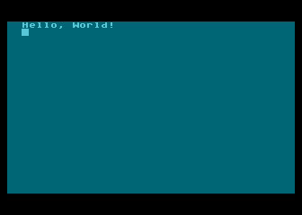

---
### Text mode 0 : print line
```
open_mode   = $ef9c     ; A=mode
clear_scr   = $f420     ; zero screen memory
print_line  = $c642     ; x=adr.lo, y=adr.hi, end line with $9b

            ldx #<hello
            ldy #>hello	
            jsr print_line

loop        jmp loop
			
hello       dta 'Hello, World!',$9b
```

---
### Text mode 0 : put byte
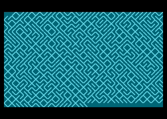


---
### Text mode 0 : put byte

```
            lda #0
            sta 82          ; LMARGN

loop        lda $d20a       ; RANDOM value
            and #1          ; get 0 or 1
            ora #6          ; / or \ character
		
            jsr $f2b0       ; put byte
            bne loop
```
16 bytes

---
### Text mode 0 : screen memory
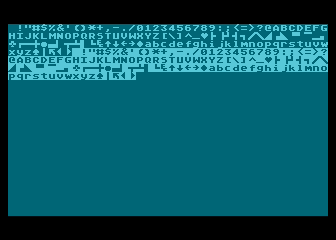

---
### Text mode 0 : screen memory
```
            lda #0
            jsr $ef9c   ; open_mode
			
            ldy #0
fill        tya
            sta ($58),y ; SAVMSC
            iny
            bne fill
	
loop        jmp loop
```
SAVMSC : pointer to screen memory

---
### Text mode 0 : custom character set
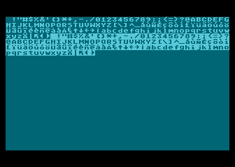

---
### Text mode 0 : custom character set

```
        lda #$cc        ; default $e0
        sta $02f4       ; CHBAS

        ldy #0
write   tya
        sta (SAVMSC),y
        iny
        bne write
```
- International character set $cc00
- Default $e000

---
### Text mode 0 : custom character set
shadow | name | hardware | name
-----|------|-----|----
$02f4 | CHBAS | $d409 | CHBASE

- Must be at 1K boundary
- Can be used in all text modes

---
### Text mode 1 : example
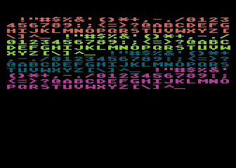

---
### Text mode 1 : example
```
open_mode   = $ef9c		; A=mode

            lda #1
            jsr open_mode
			
            ldy #0
fill        tya
            sta ($58),y     ; SAVMSC
            iny
            bne fill
	
loop        jmp loop
```

---
### Graphics mode 7 : example
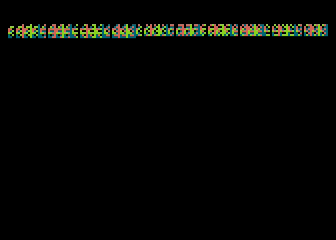

---
### Graphics mode 7 : example
```
open_mode   = $ef9c		; A=mode

            lda #7
            jsr open_mode
			
            ...
```
Same code, only mode changed

---
### Graphics modes
mode | width | height | colors | type
-----|------|:-----:|------:|-----
8 | 320 | 192 | 2 | registers
15 | 160 | 192 | 4 | registers
7 | 160 | 96 | 4 | registers
9 | 80 | 192 | 16 | grayscale
10 | 80 | 192 | 9 | registers
11 | 80 | 192 | 10 | hues

There are more, low res

---
### Color registers
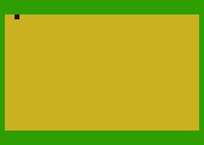

---
### Color registers

```
        lda #$0     ; black
        sta $02c5   ; COLOR1
        
        lda #$ea    ; yellow
        sta $02c6   ; COLOR2
        
        lda #$b6    ; green
        sta $02c8   ; COLOR4
```
Text mode 0

---
### Color registers
shadow | name | hardware | name
-----|------|-----|----
$02c0 - $02c3 | PCOLR0..3| $d012 - $d015 | COLPM0..3
$02c4 - $02c7 | COLOR0..3 | $d016 - $d019 | COLPF0..3
$02c8 | COLOR4 | $d01a | COLBK 

Shadow copied to hardware every vblank

---
### Display list
- OS modes are predefined
- ANTIC instructions
- Each line can be a different mode
- Each line can have new DMA
- Scrolling on/off per line
- Interrupt on/off per line

---
### Display list : mixed modes
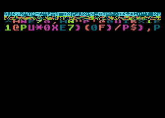

---
### Display list : mixed modes
```            
            lda #<display
            sta $230            ; SDLSTL
            lda #>display
            sta $231            ; SDLSTL+1
            
loop        jmp loop

display     dta $70,$70,$70     ; 3x8 blank lines
            dta $42, a($f000)   ; mode 0 DMA points to ROM
            dta $0d,$0d,$0d,$0d ; 4 x mode 7
            dta $06,$07         ; mode 1,2
            dta $41, a(display) ; end
```

---
### Synchronisation
- Vertical Blank Interrupt (VBI)
- Frame counter
- Display List Interrupt (DLI)
- Line counter
- Horizontal sync

---
### Sync : Vertical Blank Interrupt (1)
```
            lda #6      ; set VVBLKI
            ldy #<vbi
            ldx #>vbi
            jsr $e45c   ; SETVBV

loop        jmp loop

; a,x,y are saved by the OS
vbi         inc $02c6   ; COLOR2 
            jmp $e45f   ; SYSVBV exit vblank routine
```
18 bytes

---
### Sync : Vertical Blank Interrupt (2)

```
        org $60e2-(vbi-main)

main
        lsr $223        ; VVBKI from $c0e2 to $60e2

loop    jmp loop        ; bvc loop

; vertical blank, you can use a,x,y here
vbi     inc $02c6       ; COLOR2         
        jmp $e45f       ; SYSVBV exit vblank routine
```
12 bytes

---
### Sync : Frame counter
```
loop        lda $14     ; RTCLOK+2
wait        cmp $14
            beq wait

; executed every frame
            inc $02c6   ; COLOR2 
            jmp loop
```
RTCLOK+2 is increased every frame by the OS

12 bytes

---
### Sync : Display List Interrupt


---
### Sync : Display List Interrupt

```
        lda #<dli
        sta $200    ; VDSLST
        lda #>dli
        sta $201    ; VDSLST+1
        
        lda #$c0    ; enable DLIs 
        sta $d40e   ; NMIEN

        lda #$82    ; mode 0, enable DLI (bit7 = 1)
        sta $bc30   ; at line #12

loop    jmp loop
```

---
### Sync : Display List Interrupt
```
dli     pha
        lda #$34
        sta $d018
        pla
        rti
```
Executed on every line where DLI is enabled (bit7 = 1)

---
### Sync: Line counter


---
### Sync: Line counter
```
wait    lda $d40b   ; VCOUNT
        cmp #64
        bne wait
        
        lda #$34    ; red
        sta $d018   ; COLPF2
        bne wait
```
VCOUNT = scanline count / 2

---
### Sync: Horizontal Sync
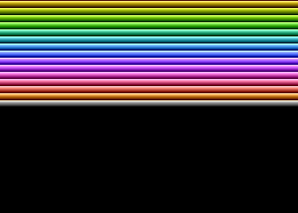

---
### Sync: Horizontal Sync

```
wait    lda $d40b   ; VCOUNT
        bne wait
        tax
        sta $022f   ; SDMCTL screen DMA off
colors  dex
        dex
        sta $d40a   ; WSYNC
        stx $d01a   ; COLBK
        bne colors
        beq wait
```
Shows all 128 colors

---
### Scrolling : Horizontal
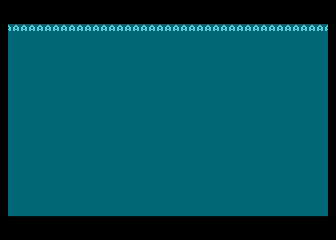

---
### Scrolling : Horizontal
```
        lda #$42+$10    ; enable hscroll in display list
        sta $bc23
        
        ldx #47         ; fill one line
fill    lda #$21        ; 'A'
        sta $bc40,x
        dex
        bpl fill
            
loop    lda $14         ; RTCLOK+2
        sta $d404       ; HSCROL
        jmp loop
```

---
### Scrolling : Vertical
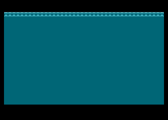

---
### Scrolling : Vertical
```
        lda #$42+$20    ; enable vscroll in display list
        sta $bc23
        
        ldx #80         ; fill two lines
fill    lda #$21        ; 'A'
        sta $bc40-1,x
        dex
        bne fill
            
loop    lda $14         ; RTCLOK+2
        and #7          ; scroll offsets 0..7
        sta $d405       ; VSCROL
        bvc loop
```

---
### Player/Missiles
- Atari name for sprites
- 4 players (8 pixels wide)
- 4 missiles (2 pixels wide)
- Single, double or quadruple width
- Missiles have player color
- Or missiles are combined to one color

---
### Player/Missiles
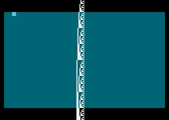

---
### Player/Missiles : DMA
```
pm_area = $4000

        lda #>pm_area
        sta $d407       ; PMBASE

        lda #3          ; P/M both on
        sta $d01d       ; GRACTL

        lda #$0e        ; white
        sta $02c0       ; PCOLR0

        lda #$78        ; x-position
        sta $d000       ; HPOSP0
```

---
### Player/Missiles : DMA

```
        lda #%00111110  ; enable P/M DMA
        sta $022f       ; SDMCTL

        ldx #0
set_p0  txa
        sta pm_area+$400,x
        inx
        bne set_p0        

loop    jmp loop
```
37 bytes

---
### Player/Missiles : no DMA
```
;        lda #>pm_area
;        sta $d407       ; PMBASE
;        lda #3          ; P/M both on
;        sta $d01d       ; GRACTL
;        lda #%00111110  ; enable P/M DMA
;        sta $022f       ; SDMCTL

        lda #$0e         ; white
        sta $02c0        ; PCOLR0

        lda #$78
        sta $d000        ; HPOSP0
```

---
### Player/Missiles : no DMA

```                
wait    lda $d40b       ; VCOUNT
        bne wait

        tax
fill    sta $d40a       ; WSYNC
        stx $d00d       ; GRAFP0
        inx
        bne fill
        beq wait
```
27 bytes (saved 10 bytes)

---
### Drawing : plot


---
### Drawing : plot

```
		lda #5		; mode 5
                jsr $ef9c       ; open_mode

                lda #2
                sta $02fb       ; ATACHR (plot color)

                lda #5
                sta $55         ; COLCRS (x position)
                lda #4
                sta $54         ; ROWCRS (y position)
                jsr $f1d8       ; plot pixel
```
Same in all modes, also text modes!

---
### Drawing : drawto
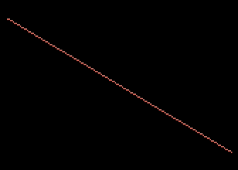

---
### Drawing : drawto
```
                lda #7
                jsr $ef9c           ; open mode
			
                inc $02fb           ; draw color 1

                lda #0
                sta $5b             ; OLDCOL (old x)
                sta $5a             ; OLDROW (old y)

                lda #159
                sta $55             ; COLCRS (new x)
                lda #95
                sta $54             ; ROWCRS (new y)
                jsr $f9c2           ; draw line
```
---
### Drawing : plot GTIA mode 9


---
### Drawing : plot GTIA mode 9

```
                lda #9
		jsr open_mode

                ldx #0
                stx $54     ; ROWCRS (y position)
more            stx $55     ; COLCRS (x position)
                stx $2fb    ; ATACHR color
                jsr $f1d8   ; plot pixel

                ldx $55     ; COLCRS (x position)
                inx
                cpx #80
                bne more
```

---
### Sound : POKEY
- 4 x 8-bit channels
- Frequency AUDF1..4
- Control AUDC1..4
- Combine 2-channels to 16-bit frequency
- Base clock 15 KHz or 64 Khz
- Polynomial counter (noise/random)
- Volume control (no ADSR)

---
### Sound : pure tone

```
        lda #$a8    ; pure tone ($a0), volume 8 ($08)
        sta $d201   ; AUDC1
        
loop    lda $14     ; RTCLOK+2
        sta $d200   ; AUDF1        
        jmp loop
```
<br/>
<audio controls="controls">
  <source type="audio/wav" src="./audio/pokey_tone.wav"></source>
</audio>

Single POKEY channel

---
### Sound : POKEY volume only

```
loop    lda $d40b   ; VCOUNT
        ora #$10    ; volume only
        sta $d201   ; AUDC1
        jmp loop
```
<br/>
<audio controls="controls">
  <source type="audio/wav" src="./audio/pokey_volume_only.wav"></source>
</audio>

Uses 4-bit POKEY volume

---
### Sound : GTIA volume only

```
loop    lda $d40b   ; VCOUNT
        sta $d01f   ; CONSOL
        jmp loop
```

<br/>
<audio controls="controls">
  <source type="audio/wav" src="./audio/gtia_volume_only.wav"></source>
</audio>

Uses 1-bit GTIA volume

---
### Tools
- WUDSN IDE, IDE for 6502 systems
https://www.wudsn.com/
- MADS, Cross assembler for 6502
http://mads.atari8.info/

- Altirra, Atari 8-bit emulator
http://www.virtualdub.org/altirra.html

---
#### Links
My presentations and code examples
https://github.com/FreddyOffenga/Sizecoding

Sizecoding wiki
http://www.sizecoding.org/

Mapping the Atari
https://www.atariarchives.org/mapping/
